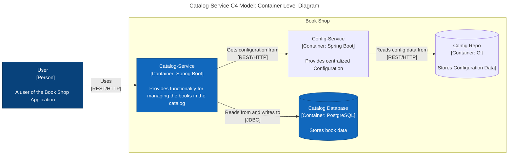

# Catalog-Service

This is stores the details of all the book that system have. It also expose the apis to perform crud on Book domain.

## API Spec for catalog-service

| Endpoint      | HTTP Method | Request Body | Status | Response Body | Description                          |
|---------------|-------------|--------------|--------|---------------|--------------------------------------|
| /books        | GET         |              | 200    | Book[]        | Get all books in the catalog         |
| /books        | POST        | Book         | 201    | Book          | Add a new book to catalog            |
|               |             |              | 422    |               | A book with same ISBN already exists |
| /books/{isbn} | GET         |              | 200    | Book          | Get the book with the given ISBN     |
|               |             |              | 404    |               | No book with the give ISBN exists    |
| /books/{isbn} | PUT         | Book         | 200    | Book          | Update the book with the given ISBN  |
|               |             |              | 201    | Book          | Create book with the given ISBN      |
| /books/{isbn} | DELETE      |              | 204    |               | Delete the book with given ISBN      |

## System Context Diagram
It's the high level view of the system, so contains the minimal level of details.

```mermaid
---
title: "Catalog-Service C4 Model: System Context"
---
flowchart LR %% flowchart left right
    User["User
    [Person]
    
    A user of the Book Shop Application"]
    subgraph BS [Book Shop]
        
        CS["Catalog-Service
        [Container: Spring Boot]
        
        Provides functionality for managing the books in the catalog"]
    end
    
    User-- "Uses\n[REST/HTTP]" -->CS

    class User person
    class CS focusSystem
```

## Catalog Service Container Level Diagram

